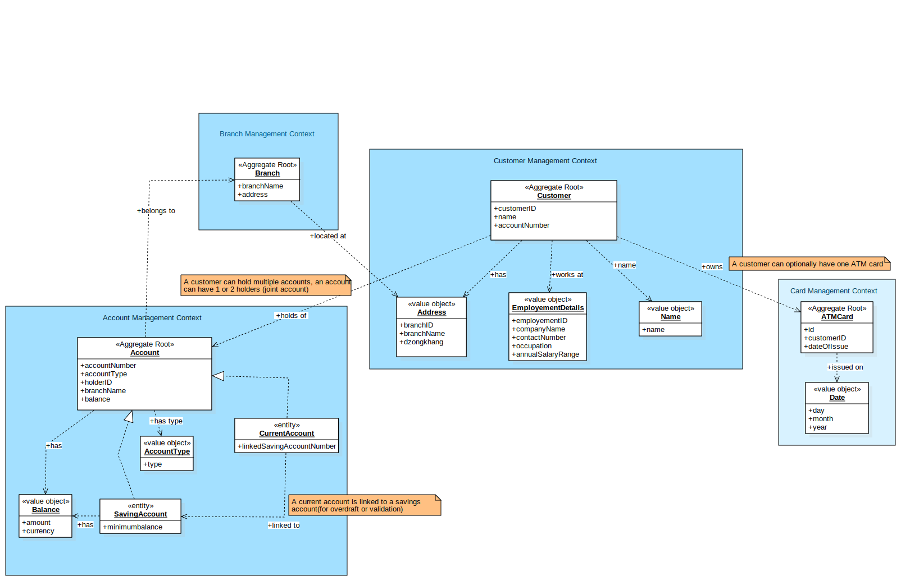

# Bank Domain Design – Domain-Driven Design (DDD)

## Scenario Overview
This domain model is based on a banking application where customers can open and manage different types of accounts (savings and current), optionally request an ATM card, and be linked to a branch. Joint accounts are allowed (up to two holders), and customers can hold multiple accounts. The goal of this model is to represent the core domain using Domain-Driven Design (DDD) principles.

## 1. Domain Object Identification
The system is divided into separate **bounded contexts**, and within them, we've identified aggregates, entities, and value objects. Below is the breakdown.

### Bounded Contexts
* **Customer Management**
* **Account Management**
* **Card Services**
* **Branch Management**

### Aggregates & Entities

#### Customer (Aggregate Root)
* `ID`
* `name` (value object)
* `address` (value object)
* `employmentDetails` (value object)
* `accountNumbers`: List of associated account numbers

#### Account (Abstract Aggregate Root)
* `accountNumber`
* `accountType` (value object)
* `holderID`
* `jointHolderID` (optional)
* `branchName`
* `balance` (value object)
* **SavingAccount (Entity)**: has `minimumBalance` (value object)
* **CurrentAccount (Entity)**: has `linkedSavingAccountNumber`

#### ATMCard (Aggregate Root)
* `ID`
* `customerID`
* `dateOfIssue` (value object)

#### Branch (Aggregate Root)
* `branchName`
* `address` (value object)

### Value Objects

| Object | Attributes |
|--------|------------|
| Name | `firstName`, `lastName` |
| Address | `street`, `city`, `state`, `zipCode` |
| EmploymentDetails | `companyName`, `telephoneNo`, `annualSalaryRange`, `occupation`, `designation` |
| AccountType | `type` (e.g., Saving, Current) |
| Money | `amount`, `currency` |
| Date | `day`, `month`, `year` |

## 2. Relationships Between Domain Objects
Here's how the objects are connected across and within bounded contexts:

* **Customer to Account**
   * A customer can hold multiple accounts.
   * An account can have 1 or 2 customers (joint account).
   * Relationship: `1..2 to *`
   * Label: `owns`

* **Customer to ATMCard**
   * A customer can have at most one ATM card.
   * Returning the card doesn't delete the customer.
   * Relationship: `1 to 0..1`
   * Label: `has`

* **Account to Branch**
   * Each account is linked to one branch.
   * A branch has many accounts but doesn't store references.
   * Relationship: `* to 1`
   * Label: `belongs to`

* **CurrentAccount to SavingAccount**
   * Every current account must reference one saving account.
   * Used for overdraft linkage.
   * Relationship: `* to 1`
   * Label: `linked to`

* **Customer to Name / Address / EmploymentDetails**
   * These are part of the customer value object structure.
   * Relationship: `1 to 1`
   * Label: `has`

* **Account to AccountType / Money**
   * All accounts have a type and balance.
   * Savings account also has a minimum balance.
   * Relationship: `1 to 1`
   * Label: `has`

* **ATMCard to Date**
   * Indicates when the card was issued.
   * Relationship: `1 to 1`
   * Label: `issued on`

* **Branch to Address**
   * Branch address is a value object.
   * Relationship: `1 to 1`
   * Label: `located at`

## 3. Domain Diagram
The full domain model has been visualized using PlantUML and exported as both `.svg` and StarUML-compatible `.mdj`.

* `bank-domain.mdj` – [StarUML project file](DomainDrivenDiagram.mdj)
* `bank-domain.svg` – 

The model includes clear bounded contexts, associations with multiplicities, and descriptive relationship labels for better readability.