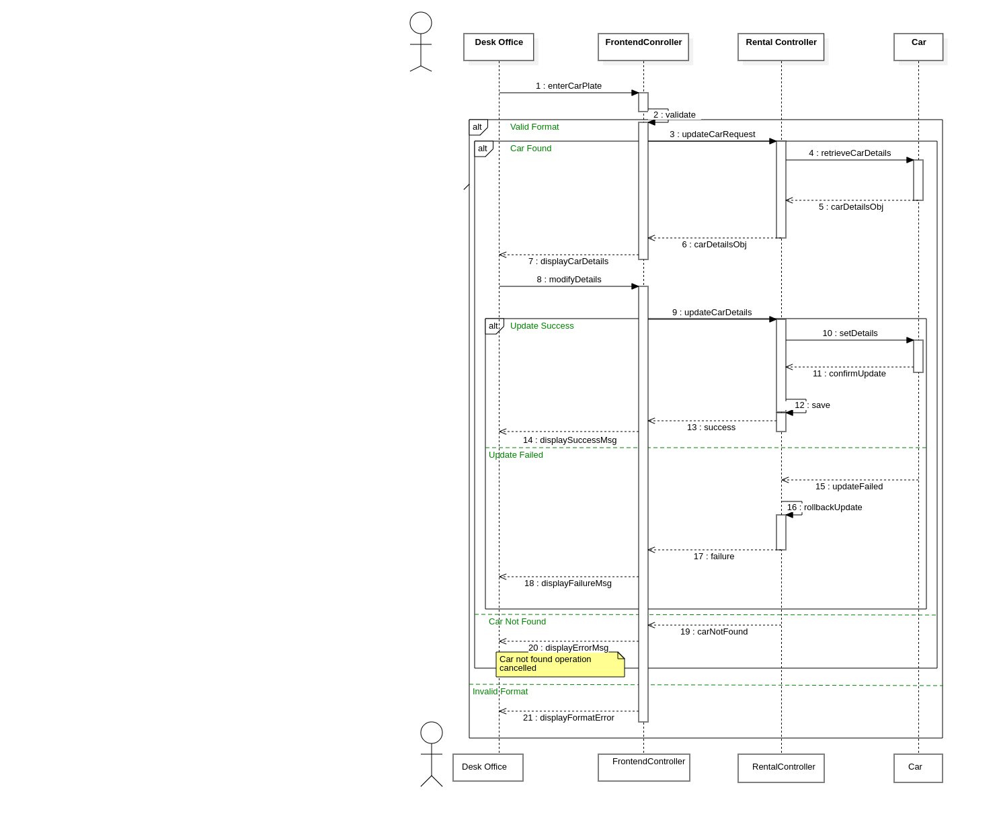

# Update Car Use Case - Basic Flow

## Basic Flow
1. **Desk Officer enters car plate number** - The desk officer inputs the car's plate number into the system
2. **System validates format** - The frontend controller validates the format of the entered plate number
3. **System sends update request** - If format is valid, the system sends an update car request to the rental controller
4. **System retrieves car details** - The rental controller requests car details from the car object
5. **System displays car information** - The retrieved car details are displayed to the desk officer
6. **Desk Officer modifies details** - The desk officer makes necessary changes to the car information on screen
7. **System processes update** - The modified details are sent to the car object for updating
8. **System saves changes** - The car object confirms the update and the system saves the changes
9. **System displays success message** - A success message is shown to confirm the update completion

## Alternate Flows

### Invalid Format
- **At step 2 of Basic Flow**: If the plate number format is invalid, the system displays a format error message

### Car Not Found
- **At step 4 of Basic Flow**: If the car cannot be found in the system, an error message is displayed indicating the car was not found

### Update Failed
- **At step 8 of Basic Flow**: If the update operation fails, the system performs a rollback and displays a failure message

## Participants
- **Desk Officer** - Initiates the car update process
- **FrontendController** - Handles user interface interactions and validation
- **RentalController** - Manages the business logic for car updates
- **Car** - Represents the car entity being updated

## Sequence Diagram

