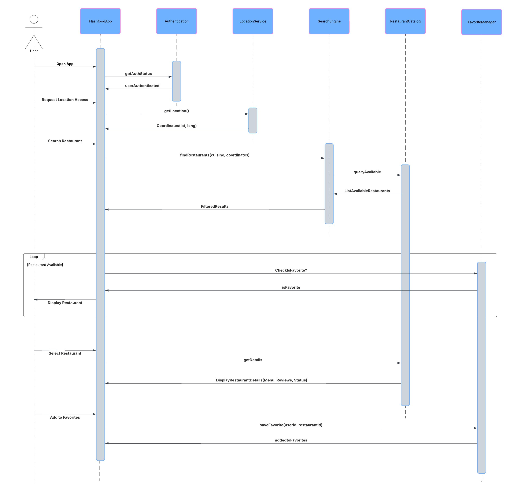

# Sequence Diagram Analysis of Flashbookup

## Introduction

Sequence diagrams are a vital tool in software architecture for visualizing interactions between system components, actors, and external services. This report analyzes the sequence diagram for **Flashbookup**, a restaurant discovery application. The diagram helps identify performance bottlenecks, dependencies, and critical business processes.

## Objective

The primary objectives of this analysis are:

- To understand the flow of interactions between services and actors in our app using Sequence Diagram.

## Procedures Involved

### 1. Component Identification

**Actors:**

- User  
- Authentication Service  
- Location Service  
- Search Engine
- Restaurant Catalog  
- Favourite Manager  

**Key Operations:**

- `getAuthStatus()` (Authentication)  
- `getLocation()` (LocationService)  
- `findRestaurant()` (SearchEngine)
- `IsFavorite()` & `saveFavorite()` & `checkisFavorite()` (Favorites Management)  

### 2. Interaction Flow Analysis

**User Request:**

- The app requests location access before searching for restaurants.
- Authentication (`getAuthStatus`) verifies user access.

**Location & Search:**

- `getLocation()` retrieves phone coordinates.
- `findRestaurant()` queries available restaurants around the radius of the user current location.

**Display & Favorites:**

- Filtered results are displayed.
- `CheckisFavorite` checks if a restaurant is favorited.
- `saveFavorite` updates the user’s favorites list.

### 3. Performance & Dependency Analysis

**External Service Dependencies:**

- **LocationService** (GPS/network-dependent)
- **SearchEngine** (depends on `RestaurantCatalog`)

**Request Overhead:**

- Multiple sequential calls (`getAuthStatus` → `getLocation` → `findRestaurant`) may introduce latency.

**Critical Components:**

- **Authentication**: Must be fast to avoid login delays.
- **SearchEngine**: High throughput needed for multiple queries.

## Outcome

### Identified Issues

- **Dependency Risks**: Failure in `LocationService` could break the entire search flow.
- **Request Overhead**: Sequential calls may slow down response times.
- **Favorites Manager**: Frequent database writes (`saveFavorite`) could strain backend resources.

### Proposed Tactics

- **Circuit Breaker**: For `LocationService` to handle location errors nicely instead of crashing.
- **Caching**: Store frequent search results to reduce `SearchEngine` load.
- **Asynchronous Processing**: Queue `saveFavorite` requests to avoid blocking UI.

## Conclusion
The sequence diagram clarifies the interaction flow in our **Flashbookup** app, highlighting critical dependencies and performance risks. By addressing request overhead (with caching/async calls) and dependency issues (with circuit breakers), the system’s reliability and speed can be improved. Future work could invlove with the focus on **load testing** and optimizing high-traffic components like `SearchEngine` and `Authentication`.
